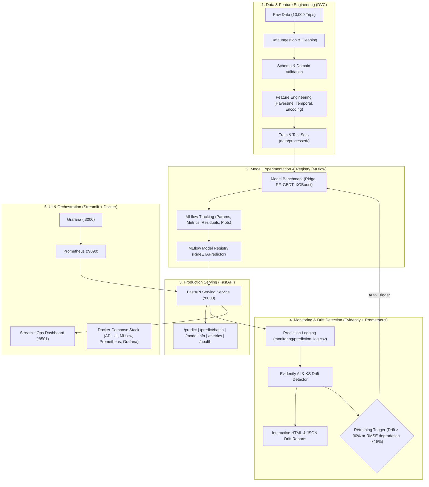

# 🚗 Ride & Delivery ETA Prediction Pipeline (Flavor A) — Production MLOps Platform

[](https://python.org)
[](https://fastapi.tiangolo.com)
[](https://mlflow.org)
[](https://dvc.org)
[](https://docker.com)
[](https://streamlit.io)
[](https://prometheus.io)

An enterprise-grade, end-to-end Machine Learning Operations (MLOps) platform for predicting ride and delivery Estimated Time of Arrival (ETA) in New York City. Built with modular pipelines, experiment tracking, automated drift detection, model registry, containerized microservices, and continuous integration.

---

## 📐 System Architecture



---

## 🌟 Key MLOps Capabilities

- **Unified Configuration**: Single source of truth in `params.yaml` managing all data paths, hyperparameters, and thresholds.
- **Reproducible DVC Pipeline**: Complete multi-stage workflow definition in `dvc.yaml` (`ingest` ➔ `validate` ➔ `feature_engineering` ➔ `train` ➔ `evaluate` ➔ `drift_analysis`).
- **Experiment Tracking & Model Registry**: Systematic MLflow logging of $R^2$, $RMSE$, $MAE$, $MAPE$, residual plots, feature importances, model signatures, and automatic candidate registration.
- **Production REST API**: FastAPI serving single (`/predict`) and batch (`/predict/batch`) inference with sub-10ms response latency, readiness probes, and Prometheus scraping endpoint (`/metrics`).
- **Continuous Monitoring & Drift Engine**: Evidently AI and Kolmogorov-Smirnov statistical tests detecting covariate and target drift, paired with an automated retraining decision engine.
- **Rich Streamlit Dashboard**: 4-tab interactive interface for single ride route simulation, batch CSV prediction, model registry leaderboard, and drift operations.
- **Containerization & CI/CD**: Multi-stage `Dockerfile`, `docker-compose.yml` (FastAPI + Streamlit + MLflow + Prometheus + Grafana), and GitHub Actions workflows for CI, CML PR commenting, and Docker smoke tests.

---

## 🗂️ Project Structure

```text
.
├── .github/workflows/
│   ├── ci.yml                 # Linting, type checks & pytest with coverage
│   ├── cml.yml                # Continuous Machine Learning PR model evaluation
│   └── docker_build.yml       # Docker build validation
├── data/
│   ├── raw/
│   │   └── ETA_Model_data.csv # Raw trip dataset (10,000 records)
│   └── processed/
│       ├── ingested_eta.csv   # Cleaned ingested data
│       ├── train_features.csv # Preprocessed training split
│       └── test_features.csv  # Preprocessed test split
├── model_store/
│   ├── eta_model.pkl          # Serialized production model
│   ├── eta_encoder.pkl        # Fitted OneHotEncoder
│   ├── feature_columns.json   # Exact feature alignment list
│   ├── model_metadata.json    # Active model metadata & lineage
│   ├── evaluation_metrics.json# Benchmark comparison metrics
│   └── plots/                 # Residual and feature importance plots
├── monitoring/
│   ├── drift_report.html      # Interactive Evidently / custom HTML dashboard
│   ├── drift_report.json      # Structured drift test results
│   ├── retrain_decision.json  # Automated retraining status & reasoning
│   ├── prometheus.yml         # Prometheus scrape configuration
│   └── grafana_dashboard.json # Grafana monitoring dashboard template
├── src/
│   ├── config.py              # Configuration loader for params.yaml
│   ├── data/
│   │   ├── ingest.py          # Data ingestion & basic sanitization
│   │   └── validate.py        # Schema & quality assertions
│   ├── features/
│   │   └── engineer.py        # Haversine distance, temporal features & encoding
│   ├── models/
│   │   ├── train.py           # Multi-model training, MLflow tracking & registration
│   │   └── evaluate.py        # Test set evaluation & CML report generator
│   ├── serving/
│   │   ├── api.py             # FastAPI serving service & Prometheus metrics
│   │   └── locations.py       # NYC neighborhood coordinates & Haversine helper
│   └── monitoring/
│       ├── drift_detector.py  # Statistical drift & Evidently report engine
│       ├── drift_simulation.py# Operational rush hour/weather drift simulator
│       └── retrain_trigger.py # Automated retraining policy engine
├── tests/
│   ├── test_data_pipeline.py  # Ingestion & validation unit tests
│   ├── test_features.py       # Feature transformation unit tests
│   ├── test_models.py         # Training & evaluation tests
│   ├── test_api.py            # FastAPI endpoint integration tests
│   └── test_monitoring.py     # Drift detection & retraining policy tests
├── ui/
│   └── app.py                 # Multi-tab Streamlit dashboard
├── params.yaml                # Centralized parameters
├── dvc.yaml                   # DVC pipeline specification
├── Dockerfile                 # Multi-stage production container definition
├── docker-compose.yml         # Multi-service stack orchestration
├── Makefile                   # Developer CLI commands
└── requirements.txt           # Python dependencies
```

---

## 🚀 Quick Start Guide

### 1. Environment Setup

```bash
# Clone and enter the repository
git clone <repo-url>
cd group-21-flavor-a

# Install dependencies
python -m pip install -r requirements.txt
```

### 2. Run the End-to-End Pipeline (One Command)

```bash
make pipeline
```

*Or execute individual stages:*

```bash
# Stage 1: Data Ingestion & Validation
python src/data/ingest.py
python src/data/validate.py

# Stage 2: Feature Engineering & Preprocessing
python src/features/engineer.py

# Stage 3: Multi-Model Benchmark & MLflow Registration
python src/models/train.py

# Stage 4: Standalone Model Evaluation & CML Report
python src/models/evaluate.py

# Stage 5: Data Drift Analysis
python src/monitoring/drift_detector.py
```

### 3. Start the FastAPI Serving Server

```bash
# Start FastAPI on port 8000
python -m uvicorn src.serving.api:app --host 0.0.0.0 --port 8000 --reload
```

- Interactive Swagger Docs: [http://127.0.0.1:8000/docs](http://127.0.0.1:8000/docs)
- Liveness Probe: [http://127.0.0.1:8000/health](http://127.0.0.1:8000/health)
- Model Metadata: [http://127.0.0.1:8000/model-info](http://127.0.0.1:8000/model-info)
- Prometheus Metrics: [http://127.0.0.1:8000/metrics](http://127.0.0.1:8000/metrics)

### 4. Launch the Streamlit Dashboard

```bash
# Start Streamlit UI on port 8501
python -m streamlit run ui/app.py --server.port 8501
```

- Open in browser: [http://localhost:8501](http://localhost:8501)

---

## 📡 REST API Reference

### Single Prediction (`POST /predict`)

**Request Payload:**
```json
{
  "pickup_location": "Upper West Side",
  "drop_location": "Harlem",
  "pickup_date": "2026-08-27",
  "pickup_time": "17:30",
  "passenger_count": 1,
  "surge_multiplier": 1.0
}
```

**Response:**
```json
{
  "success": true,
  "eta_minutes": 14.85,
  "eta_seconds": 891.0,
  "calculated_distance_km": 3.75,
  "estimated_traffic_level": "High",
  "pickup_location": "Upper West Side",
  "drop_location": "Harlem",
  "pickup_date": "2026-08-27",
  "pickup_time": "17:30",
  "timestamp": "2026-08-27T00:00:00.000Z"
}
```

### Batch Prediction (`POST /predict/batch`)

**Request Payload:**
```json
{
  "trips": [
    {
      "pickup_location": "Upper West Side",
      "drop_location": "Harlem",
      "pickup_date": "2026-08-27",
      "pickup_time": "17:30"
    },
    {
      "pickup_location": "Chelsea",
      "drop_location": "South Slope",
      "pickup_date": "2026-08-27",
      "pickup_time": "08:15"
    }
  ]
}
```

---

## 🐳 Docker Containerization & Compose

Launch the full 5-service MLOps ecosystem with a single command:

```bash
docker compose up --build -d
```

| Service | Port | Description |
| :--- | :--- | :--- |
| **FastAPI** | `8000` | High-performance inference engine & metrics |
| **Streamlit** | `8501` | Operations & Prediction Dashboard |
| **MLflow** | `5000` | Experiment tracking server & model registry |
| **Prometheus** | `9090` | Time-series metrics collection |
| **Grafana** | `3000` | Visualization dashboard (Credentials: `admin`/`admin`) |

To shut down the stack:
```bash
docker compose down
```

---

## 🧪 Testing & Code Quality

Run the full automated test suite with coverage:

```bash
# Run pytest with coverage report
python -m pytest tests/ -v --cov=src --cov-report=term-missing
```

---

## 🔄 Automated Drift & Retraining Strategy

1. **Drift Detection**: Kolmogorov-Smirnov and Evidently AI algorithms compute feature-by-feature divergence between baseline and live operational prediction logs.
2. **Evaluation Policy**:
   - $\Delta \text{RMSE} > 15\%$ above baseline validation error $\rightarrow$ Alert & Retrain Trigger.
   - Dataset Feature Drift Share $\ge 30\% \rightarrow$ Alert & Retrain Trigger.
3. **Simulation**: Use `python src/monitoring/drift_simulation.py` to simulate evening rush-hour congestion and adverse weather conditions to validate trigger behavior.
